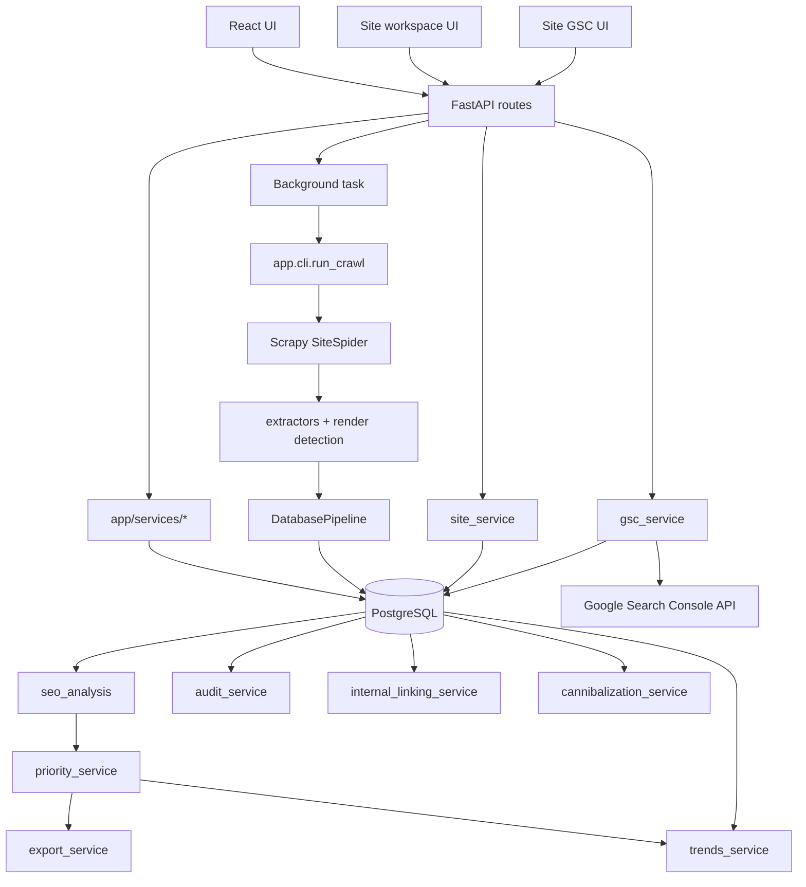

# ARCHITECTURE.md

## Zakres systemu
Repo zawiera lokalna aplikacje do:
- uruchamiania crawl snapshotow dla jednej domeny,
- trzymania trwalego workspace witryny (`Site`),
- zapisu stron i linkow do PostgreSQL,
- budowania pochodnych sygnalow SEO, audytu i eksportow CSV,
- trwalej, deterministycznej klasyfikacji page taxonomy w `pages`,
- site-centric Content Recommendations liczonych dynamicznie z own data only,
- site-centric Competitive Gap liczonych dynamicznie nad aktywnym snapshotem i manual competitors,
- site-centric AI Review Editor dla dokumentow redakcyjnych z review/rewrite/version workflow,
- rownoleglej semantic foundation / semantic arbiter warstwy cache, statusow i legacy fallbacku dla Competitive Gap,
- snapshot-aware Content Gap Review flow z persisted candidates, review runs i reviewed items,
- prezentacji danych w UI React,
- lokalnej integracji z Google Search Console, gdzie konfiguracja nalezy do `site`, a import danych pozostaje per `crawl_job`,
- analiz snapshotowych: opportunities, internal linking, cannibalization i trends.

## Glowny model mentalny
- `Site` = trwala przestrzen robocza witryny.
- `CrawlJob` = snapshot tej witryny w czasie.
- `pages`, `links`, audit, opportunities, internal linking i cannibalization sa liczone dla jednego konkretnego `crawl_job`.
- `pages` niosa tez trwale pola page taxonomy zapisane per rekord snapshotu.
- AI Review Editor jest osobnym site-level workflow dokumentowym:
  - aktualny stan dokumentu bierze sie z aktywnych `editor_document_blocks`,
  - `source_content` i `normalized_content` sa reprezentacjami pochodnymi synchronizowanymi z blokow,
  - issue i rewrite sa przypiete do konkretnego review runu nad konkretnym stanem dokumentu,
  - version history/rollback materializuje nowe snapshoty dokumentu bez cofania historii.
- Content Recommendations sa warstwa site-level liczona nad aktywnym snapshotem, taxonomy, GSC, internal linking i priority signals.
- Competitive Gap jest warstwa site-level liczona nad aktywnym snapshotem, strategiami site-level i current competitor extractions.
- Content Gap Review doklada trzy persisted warstwy snapshot-aware:
  - `site_content_gap_candidates`
  - `site_content_gap_review_runs`
  - `site_content_gap_items`
- backendowy read model Competitive Gap czyta dane w kolejnosci:
  - reviewed items dla aktywnego snapshotu,
  - raw candidates dla aktywnego snapshotu,
  - legacy dynamic fallback.
- semantic foundation i semantic arbiter pozostaja trwala warstwa competitorowa: cache'uja merge/match/canonical naming i statusy oraz sluza jako enrichment/legacy fallback, ale nie sa juz auto-triggerowanym primary path dla review layer.
- lifecycle rekomendacji (`mark done`, implemented, outcome tracking, filters i outcome windows) jest cienka, trwala warstwa site-level nad dynamicznym payloadem rekomendacji.
- compare w site workspace jest warstwa nad `active_crawl_id` i `baseline_crawl_id`, a nie osobnym magazynem danych.
- `GscProperty` jest trwale przypiete do `site`.
- `gsc_url_metrics` i `gsc_top_queries` pozostaja zapisane per `crawl_job`.
- `site_content_recommendation_states` przechowuje tylko stan lifecycle rekomendacji; nie przenosi snapshotowych danych do nowego store compare.
- stale review w AI Review Editor nie jest auto-remapowane do nowego stanu dokumentu:
  - po zmianie aktywnych blokow ostatni review staje sie historycznym kontekstem,
  - issue workflow jest wtedy blokowany do czasu nowego review,
  - rewrite apply jest dozwolony tylko wtedy, gdy rewrite input nadal pasuje do aktualnego stanu dokumentu.

To jest glowny invariant repo:
- konfiguracja integracji moze byc site-level,
- dane snapshotowe nie moga mieszac wielu crawl snapshotow w podstawowych tabelach.

## Glowny podzial odpowiedzialnosci
- FastAPI w `app/api/` wystawia API i deleguje do `app/services/`.
- `app/services/` jest warstwa aplikacyjna i read-modelowa.
- Scrapy w `app/crawler/` odpowiada za pobranie i ekstrakcje danych strony.
- SQLAlchemy w `app/db/` przechowuje model trwaly.
- React w `frontend/src/` konsumuje API; stan filtrow/sortowania jest trzymany glownie w query stringu.

## Kluczowe komponenty

### 1. Tworzenie `Site` i `CrawlJob`
- `POST /crawl-jobs` normalizuje URL startowy, znajduje lub tworzy `Site`, a potem tworzy nowy `CrawlJob`.
- `POST /sites/{site_id}/crawls` tworzy nowy snapshot dla istniejacego `Site`, pilnujac zgodnosci domeny.
- Oba flow reuse'uja logike z `app/services/crawl_job_service.py`.

To jest wazne:
- repo jest juz site-centric przy tworzeniu nowych crawl snapshotow,
- `site_id` jest trwalym kluczem laczacym kolejne crawle tej samej witryny,
- sam snapshot nadal jest osobnym `crawl_job`.

### 2. Wykonanie crawl joba
- Route tworzy rekord `pending` i dodaje `BackgroundTasks` wywolujace `crawl_job_service.run_crawl_job_subprocess(...)`.
- Subprocess odpala `python -m app.cli.run_crawl --job-id ...`.
- `app.cli.run_crawl` ustawia job na `running`, buduje settings Scrapy i uruchamia `SiteSpider`.

To jest wazne:
- crawl nie dzieje sie w samym request handlerze,
- wejscie HTTP i wejscie CLI prowadza do tej samej logiki crawl joba.

### 3. Crawl, ekstrakcja i zapis
- `SiteSpider` normalizuje URL-e, pilnuje limitow i scheduluje requesty.
- Dla HTML:
  - ekstraktory z `app/crawler/extraction/*` buduja `ExtractedPageData`,
  - heurystyka `rendering/detection.py` decyduje o ewentualnym renderze,
  - przy `render_mode=auto|always` moze wejsc Playwright fallback.
- Spider yielduje `PageWithLinksItem`.
- `DatabasePipeline` zapisuje `Page`, potem `Link`.

Model zapisu pozostaje prosty:
- `pages` i `links` sa danymi bazowymi jednego snapshotu `crawl_job`,
- audit i read modele sa liczone dynamicznie z danych bazowych.

Page taxonomy po ETAPIE 11.1:
- `Page` ma trwale pola:
  - `page_type`
  - `page_bucket`
  - `page_type_confidence`
  - `page_type_version`
  - `page_type_rationale`
- klasyfikacja siedzi w `app/services/page_taxonomy_service.py`,
- nowe snapshoty dostaja klasyfikacje w flow CLI / stats,
- starsze snapshoty sa backfillowane lazy podczas odczytu.

### 4. Site workspace i kontekst snapshotu
- `app/services/site_service.py` sklada:
  - liste witryn,
  - szczegoly witryny,
  - historie crawl snapshotow,
  - kontekst `active_crawl_id`,
  - opcjonalny `baseline_crawl_id`.
- `frontend/src/layouts/AppLayout.tsx` trzyma app shell z:
  - sticky headerem,
  - sidebarowym site switcherem i globalna nawigacja,
  - route-aware tytulem aktualnej sekcji.
- `frontend/src/features/sites/SiteWorkspaceLayout.tsx` trzyma ten sam kontekst w URL:
  - `active_crawl_id`
  - `baseline_crawl_id`
- `Site Overview`, `Site Crawls` (`Historia`, `Nowy crawl`), `Site GSC` (`Przeglad`, `Konfiguracja`, `Import`), `Site Progress`, `Site Changes Hub` oraz site compare views pracuja w tym samym workspace.
- `Site Overview` jest widokiem current-first: centrum stanowi aktywny crawl, baseline jest tylko pomocniczym kontekstem dla sekcji `Zmiany`.
- `Site Progress` reuse'uje istniejace site compare summary, aktywny snapshot, GSC summary, opportunities, internal linking overview i lifecycle Content Recommendations, aby odpowiedziec na pytanie `czy idziemy do przodu?` bez nowego magazynu danych.
- shell witryny daje uporzadkowany context bar:
  - nazwa witryny
  - root URL
  - aktywny crawl
  - status GSC
  - CTA `Nowy crawl`
  - lekkie `Operacje` z linkiem do aktywnego crawla i subtelnym wejsciem do `Zmian`

Site compare po ETAPIE 10.3:
- `app/services/site_compare_service.py` sklada compare payloady dla:
  - `/sites/{site_id}/pages`
  - `/sites/{site_id}/audit`
  - `/sites/{site_id}/opportunities`
  - `/sites/{site_id}/internal-linking`
- payload zawsze zachowuje jedna baze snapshotowa:
  - aktywny crawl jest glownym snapshotem roboczym,
  - baseline crawl jest tylko kontekstem porownawczym zarzadzanym w sekcji `Zmiany`,
  - compare nie zapisuje nowych tabel ani nie miesza wielu crawl snapshotow w `pages` / `links`.

To jest wazne:
- `site` nie miesza snapshotowych tabel,
- jest tylko cienka warstwa nawigacyjna i orkiestracyjna nad istniejacym job-centric core,
- shell i routing wystawiaja juz current-state views dla `pages`, `audit`, `opportunities` i `internal-linking` nad aktywnym crawlem, a compare pozostaje dodatkowa warstwa grupowana w sekcji `Zmiany`.

### 4a. AI Review Editor
- `app/api/routes/site_ai_review_editor.py` wystawia site-level API pod `/sites/{site_id}/ai-review-editor/*`.
- `app/services/ai_review_editor_service.py` odpowiada za:
  - create/list/get/update dokumentu,
  - parse HTML do aktywnych blokow,
  - skladanie current-state payloadu dokumentu.
- `editor_document_block_service.py` obsluguje lokalne mutacje dokumentu:
  - inline manual edit pojedynczego bloku,
  - insert before / insert after / append,
  - delete bloku z guardem ostatniego aktywnego bloku,
  - reindex i synchronizacje reprezentacji dokumentu.
- `editor_document_version_service.py` materializuje historyczne snapshoty dokumentu:
  - `document_parse`
  - `document_update`
  - `manual_block_edit`
  - `block_insert`
  - `block_delete`
  - `rewrite_apply`
  - `rollback`
- `editor_review_run_service.py` zapisuje review runs, issues i summary przypiete do `document_version_hash`.
- `editor_rewrite_service.py` pilnuje governance workflow issue:
  - stale review blokuje nowe akcje issue,
  - rewrite apply jest single-block apply,
  - rewrite preview jest bezpieczny do apply tylko wtedy, gdy nadal zgadza sie z current block/current document.

To jest wazne:
- kanoniczny current source of truth dokumentu to aktywne `editor_document_blocks`,
- `source_content` i `normalized_content` pozostaja reprezentacja pochodna, nie drugim miejscem prawdy,
- restore / rollback tworzy nowy aktualny stan bez nadpisywania historii,
- modul celowo nie ma drag & drop reorder, split/merge blokow, collaborative editing, websocket/live sync ani auto-remapowania issue.

### 5. Snapshotowy read model
- `seo_analysis.build_page_records()` serializuje `Page` i dokleja pochodne flagi:
  - title/meta/H1/canonical/indexability/content/media
  - rendering/schema/robots
  - page taxonomy (`page_type`, `page_bucket`, confidence, version, rationale)
  - GSC metrics i licznik top queries
- `priority_service.apply_priority_metadata()` dokleja dynamiczne pola decyzyjne:
  - `priority_score`
  - `priority_level`
  - `priority_rationale`
  - breakdown score
  - `opportunity_count`
  - `primary_opportunity_type`
  - `opportunity_types`
- `seo_analysis.build_link_records()` buduje sygnaly link health na podstawie `Page` i `Link`.
- `crawl_job_service`, `audit_service`, `internal_linking_service`, `cannibalization_service` i `trends_service` reuse'uja te same snapshotowe dane.

Wniosek praktyczny:
- jesli zmieniasz semantyke pages/audytu/filtrowania, najpierw patrz w `seo_analysis.py` i `crawl_job_service.py`,
- jesli zmieniasz klasyfikacje stron, zacznij od `page_taxonomy_service.py`, a potem sprawdz kontrakt API i eksport,
- jesli zmieniasz scoring albo heurystyki Content Recommendations, zacznij od `content_recommendation_rules.py` i `content_recommendation_service.py`,
- nie tworz osobnych tabel raportowych dla jednej funkcji, jesli read model da sie policzyc z istniejacych snapshotow.

### 6. GSC: konfiguracja site-level, import snapshot-level
- `app/integrations/gsc/auth.py` trzyma lokalny OAuth state i token w plikach.
- `app/integrations/gsc/client.py` opakowuje Search Console API.
- `app/services/gsc_service.py` robi:
  - listowanie property,
  - walidacje dopasowania property do `site`,
  - zapis wybranego property na `site`,
  - import metrics per URL do konkretnego `crawl_job`,
  - import top queries per URL do konkretnego `crawl_job`,
  - summary i top queries dla snapshotu,
  - site-level summary dla `active_crawl`.

Publiczne API ma dwa wejscia:
- site-level:
  - `/sites/{site_id}/gsc/*`
  - to jest glowny flow konfiguracji i importu, rozdzielony w UI na overview / settings / import
- legacy job-level:
  - `/crawl-jobs/{job_id}/gsc/*`
  - to jest dalej wspierany snapshot view i bezpieczny mostek wsteczny

To jest wazne:
- `GscProperty` nalezy do `site`,
- `gsc_url_metrics` i `gsc_top_queries` dalej naleza do jednego `crawl_job`,
- nowe crawle tej samej witryny reuse'uja to samo powiazanie GSC bez ponownego wyboru property.

### 7. Opportunities, internal linking, cannibalization i trends
- `priority_rules.py` / `priority_service.py`: priority score i opportunities
- `internal_linking_service.py`: snapshotowy internal linking read model
- `cannibalization_service.py`: query overlap i klastry konfliktow URL-i per snapshot
- `trend_rules.py` / `trends_service.py`: compare crawl snapshotow i compare zakresow GSC
- `site_compare_service.py`: compare-ready payloady dla site-centric UX w pages / audit / opportunities / internal linking

To jest wazne:
- compare reuse'uje istniejace snapshoty,
- nie ma osobnego snapshot store poza `crawl_jobs` i danymi GSC zapisanymi per crawl.

### 7a. Content Recommendations (ETAP 11.2 / 11.3)
- `app/services/content_recommendation_rules.py` trzyma centralnie:
  - recommendation types
  - segmenty
  - wagi tokenow topic extraction
  - progi scoringu, confidence, impact i effort
- `app/services/content_recommendation_service.py` sklada site-level payload nad:
  - aktywnym `crawl_job`
  - page taxonomy z ETAPU 11.1
  - snapshotowymi danymi GSC i top queries
  - internal linking
  - priority / opportunities
  - cannibalization jako sygnalem pomocniczym
- `app/services/content_recommendation_keys.py` buduje centralnie deterministyczny `recommendation_key`
- `site_content_recommendation_states` przechowuje cienki lifecycle state:
  - `implemented_at`
  - `implemented_crawl_job_id`
  - opcjonalny baseline z chwili klikniecia
  - snapshot helpera / sygnalow do pozniejszego outcome compare
- endpointy:
  - `GET /sites/{site_id}/content-recommendations`
  - `POST /sites/{site_id}/content-recommendations/mark-done`
  - `GET /sites/{site_id}/export/content-recommendations.csv`

To jest wazne:
- modul jest own-data only
- nie korzysta z competitor compare, external keyword APIs, embeddings, NLP ani LLM
- aktywne rekomendacje sa nadal liczone dynamicznie nad aktywnym snapshotem
- `mark done` chowa rekomendacje tylko dla tego samego `active_crawl_id`; jesli ten sam problem wraca po przyszlym crawl snapshot, rekomendacja moze znowu pojawic sie jako aktywna
- implemented outcome jest liczony dynamicznie przez porownanie snapshotu z chwili wdrozenia do aktualnego aktywnego snapshotu workspace
- ETAP 11.3B doklada tylko cienka warstwe query/read-model:
  - outcome windows `7d` / `30d` / `90d` / `all`
  - status `too_early`, gdy aktywny snapshot jest zbyt blisko `implemented_at`
  - backendowe filtrowanie i sortowanie sekcji implemented
  - backendowy `implemented_summary` z `total_count`, `status_counts` i `mode_counts`
  - summary scope liczony po outcome window / mode / search, ale przed status drilldown
  - shared status order jest trzymany osobno per warstwa: backend reuse'uje jedna kolejnosc do summary i sortowania, frontend do render order badge'y i labels
- ETAP 11.3B nie dodaje nowej tabeli, migracji ani event history; reuse'uje ten sam lifecycle state i te same snapshotowe sygnaly
- nie zapisuje nowej trwałej warstwy snapshotowej; payload jest liczony dynamicznie
- eksport reuse'uje ten sam payload i te same filtry co UI

### 7b. Competitive Gap (ETAP 12A)
- `site_content_strategies` trzyma manualna strategie site-level i metadata normalizacji LLM.
- `site_competitors`, `site_competitor_pages` i `site_competitor_page_extractions` sa osobnym store competitorowym przypietym do `site`.
- `site_competitor_semantic_candidates` jest deterministyczna semantic foundation nad `site_competitor_pages`:
  - trzyma semantic eligibility / exclusion metadata,
  - materializuje raw topic candidates,
  - buduje top-K listy kandydatow do merge i own-match bez all-to-all scan.
- `site_competitor_sync_runs` jest cienka, trwala warstwa operacyjna dla manual competitor syncu:
  - run-level status
  - heartbeat / lease
  - stale detection po restarcie API
  - retry / reset runtime
- `site_competitor_semantic_runs` i `site_competitor_semantic_decisions` sa cienka, trwala warstwa operacyjna / cache dla semantic layer:
  - statusy i heartbeat semantic runow,
  - lease/heartbeat sa dotykane wieloetapowo podczas merge/match, zeby dluzsze runy nie wpadaly zbyt latwo w `stale`,
  - cache decyzji merge topic / own-site match / canonical naming,
  - fallback/debug metadata wykorzystywane tez przez finalny gap payload i readiness debug,
  - readiness debug moze pokazac latest operational error z najnowszego runu, ale liczby/model/prompt sa brane z ostatniego displayable semantic summary, zeby pusty `stale` retry nie zerowal operatorowi diagnostyki.
- manual competitor sync jest uruchamiany jawnie przez UI/API i zapisuje:
  - competitor pages,
  - extraction history,
  - lightweight sync diagnostics per competitor,
  - latest snapshot diagnostyczny na `site_competitors`.
- po udanym syncu backend odswieza competitor store, semantic foundation i zapisuje raw candidates do `site_content_gap_candidates`; nie odpala juz automatycznie review LLM.
- Semstorm ma osobna, cienka warstwe discovery site-level:
  - preview endpoint dalej jest lekkim debug/manual payloadem bez persistencji,
  - persisted store `site_semstorm_discovery_runs` / `site_semstorm_competitors` / `site_semstorm_competitor_queries` trzyma historie runow, wybranych competitorow i ich top queries,
  - `GET .../semstorm/opportunities` sklada osobny Semstorm coverage/opportunity layer nad persisted discovery, aktywnym crawlem i opcjonalnymi sygnalami GSC,
  - lifecycle state siedzi osobno w `site_semstorm_opportunity_states`, z kluczem opartym o `site_id + normalized_keyword`, wiec ta sama fraza moze wracac miedzy runami bez gubienia stanu `new/accepted/dismissed/promoted`,
  - promotion idzie do osobnego backlogu `site_semstorm_promoted_items`; nie reuse'uje `site_content_gap_candidates` ani `site_content_gap_items`, zeby nie mieszac Semstorm z manual competitor sync flow ani finalnym read modelem `reviewed -> raw_candidates -> legacy`,
  - promoted backlog moze byc dalej zmaterializowany do osobnego planning store `site_semstorm_plan_items`; ten planning layer pozostaje osobny wobec `site_content_recommendation_states` i `content_recommendation_service.py`, bo Content Recommendations sa own-data only,
  - plan items moga byc dalej zmaterializowane do osobnego execution layer `site_semstorm_brief_items`; brief scaffold pozostaje deterministycznym, recznie edytowalnym artefaktem `Plans -> Briefs`, bez Content Recommendations i bez finalnego Competitive Gap read modelu,
  - execution lifecycle nie tworzy osobnej mini-Jiry: rozszerza ten sam brief artifact o `draft -> ready -> in_execution -> completed -> archived`, `assignee`, `execution_note` i stemple czasowe,
  - po zakonczeniu execution ten sam brief artifact moze wejsc do osobnego feedback loopu `implemented / evaluated / archived`; outcome read model pozostaje dynamiczny i liczony nad aktywnym snapshotem, dostepnymi `pages`, `gsc_url_metrics` i `gsc_top_queries`, bez zapisu czegokolwiek do podstawowych tabel snapshotowych,
  - optional AI enrichment siedzi jeszcze osobno w `site_semstorm_brief_enrichment_runs`; `POST .../briefs/{brief_id}/enrich` tworzy jawny run draftu sugestii, a `POST .../enrichment-runs/{run_id}/apply` aktualizuje tylko niepuste pola briefu, bez nadpisywania go pustymi wartosciami i bez tworzenia rownoleglego content flow,
  - coverage jest heurystyczne i deterministyczne: sprawdza keyword / normalized keyword w `title`, `h1`, `meta_description` i URL wlasnych stron aktywnego snapshotu, a potem klasyfikuje `missing` / `weak_coverage` / `covered`,
  - optional GSC enrichment pozostaje lekki: exact / normalized-exact / very-light contains nad `gsc_top_queries` plus fallback do URL metrics dla matched page,
  - wynik Semstorm zwraca dalej osobny `decision_type`, `opportunity_score_v2` i `coverage_status`; nie zmienia kolejnosci finalnego source selection `reviewed -> raw_candidates -> legacy`,
  - warstwa ta nie reuse'uje `site_competitor_pages`, nie miesza sie z manual competitor sync HTML flow i nie zmienia kolejnosci finalnego source selection `reviewed -> raw_candidates -> legacy`.
- `site_content_gap_review_runs` zamraza:
  - `basis_crawl_job_id`
  - candidate scope
  - `candidate_set_hash`
  - `own_context_hash`
  - `gsc_context_hash`
  - model/prompt/schema metadata
- `site_content_gap_items` przechowuje reviewed outcome per candidate / review run.
- `competitive_gap_service.py` sklada finalny payload w kolejnosci:
  - reviewed items dla aktywnego snapshotu,
  - raw candidates dla aktywnego snapshotu,
  - legacy dynamic payload.
- UI i CSV reuse'uja ten sam source selection; przy zmianie aktywnego crawla reviewed/raw dla starego snapshotu nie sa pokazywane jako current.
- LLM w semantic layer widzi tylko top 5-10 kandydatow z foundation i rozstrzyga:
  - competitor topic merge (`same_topic`, `related_subtopic`, `different_topic`)
  - competitor topic -> own-site match (`exact_match`, `semantic_match`, `partial_coverage`, `no_meaningful_match`)
  - `canonical_topic_label`, rationale i confidence
- backend wystawia:
  - reczny endpoint `POST /sites/{site_id}/competitive-content-gap/semantic/re-run` dla legacy/auxiliary semantic layer,
  - lekkie endpointy review runow (`GET .../review-runs`, `POST .../review-runs/{run_id}/retry`) dla explicit Content Gap Review flow.
- backend zwraca tez readiness / empty-state diagnostics dla:
  - active crawl,
  - strategy present,
  - active competitors,
  - competitor pages,
  - current competitor extractions.
- frontend Competitive Gap jest cienka warstwa orkiestracyjna nad tym read modelem:
  - pokazuje readiness panel,
  - pokazuje source mode `reviewed/raw/legacy`, outdated helper i latest review run status,
  - pokazuje semantic debug/status panel z agregowanym statusem, ostatnim runem, cache hits, fallback count i last error,
  - rozroznia empty states po `empty_state_reason`,
  - lazy-loaduje explanation dopiero po kliknieciu w pojedynczy row,
  - pokazuje lekki operator UI dla `manual competitors`:
    - last run / recent runs
    - retry failed/stale run
    - reset runtime state
    - bez osobnego dashboardu jobow competitorowych.
  - pokazuje tez lekki operator/debug flow dla review runow:
    - latest review run status,
    - ostatnie runy,
    - retry failed/stale/cancelled runu tylko dla aktywnego snapshotu.

To jest wazne:
- competitor data nie trafia do `pages` ani `links`,
- sync diagnostics sa cienka warstwa operacyjna na `site_competitors`,
- semantic layer jest warstwa enrichment/cache zintegrowana z finalnym Competitive Gap read modelem; CSV export reuse'uje ten sam semantic-enriched payload co UI,
- sync run store nie jest worker queue i nie wprowadza websocketow / Celery / Redis,
- eksport CSV reuse'uje ten sam read model Competitive Gap co UI.

### 7c. AI Review Editor
- `app/api/routes/site_ai_review_editor.py` wystawia site-level API dla dokumentow AI Review Editor.
- `app/services/ai_review_editor_service.py` odpowiada za create/list/get/update dokumentu i parse HTML do blokow.
- `app/services/editor_document_block_service.py` utrzymuje kanoniczny current state przez:
  - inline manual edit pojedynczego bloku,
  - insert before / insert after / insert end,
  - delete block,
  - reindex i sync pochodnych reprezentacji dokumentu.
- `app/services/editor_document_version_service.py` materializuje wersje dokumentu:
  - capture snapshotu po parse / edit / insert / delete / rewrite apply / rollback,
  - diff preview miedzy wersjami,
  - restore starszej wersji jako nowego current state.
- `app/services/editor_review_run_service.py` uruchamia review nad aktywnymi blokami i trzyma governance:
  - latest review run moze byc `current` albo `stale`,
  - stale review pozostaje tylko historycznym kontekstem,
  - issue workflow jest blokowany, gdy review nie pasuje juz do aktualnego stanu dokumentu.
- `app/services/editor_review_llm_service.py` i `app/services/editor_rewrite_llm_service.py` sa structured LLM layers:
  - review zwraca tylko znormalizowane issue wysokiej jakosci dla dozwolonych typow/severity,
  - rewrite dotyczy dokladnie jednego bloku i zwraca tylko `block_key` + `rewritten_text`.
- `app/services/editor_rewrite_service.py` utrzymuje workflow issue/rewrite:
  - `dismiss`
  - `resolved_manual`
  - request AI rewrite
  - apply rewrite
  - stale/actionability guards dla review issue i rewrite preview.

To jest wazne:
- source of truth dokumentu to aktywne `editor_document_blocks`, nie historyczne snapshoty ani stare `source_content`,
- `source_content` i `normalized_content` sa tylko reprezentacjami pochodnymi synchronizowanymi z blokow,
- modul nie robi automatycznego remapowania issue do nowego current state po zmianie dokumentu,
- rollback/restore tworzy nowa aktualna wersje zamiast nadpisywac historie.

### 8. Frontend
- `routes/AppRoutes.tsx` startuje od `/sites`.
- `frontend/src/layouts/AppLayout.tsx` jest glownym shellem aplikacji i prowadzi usera przez site-centric routing.
- `frontend/src/features/sites/` jest glownym shellem pracy z witryna wewnatrz app shellu.
- sidebar jest glowna nawigacja systemu; header nie niesie glownej nawigacji ani site switchera.
- foundation routingu obejmuje tez:
  - `/sites/new`
  - `/sites/:siteId/progress`
  - `/sites/:siteId/changes`
- kanoniczne compare entry pointy sekcji `Zmiany` obejmuja tez:
  - `/sites/:siteId/changes/pages`
  - `/sites/:siteId/changes/audit`
  - `/sites/:siteId/changes/opportunities`
  - `/sites/:siteId/changes/internal-linking`
- `/sites/:siteId/progress` jest juz realnym site-level dashboardem postepu, ale nadal opiera sie na istniejacych payloadach i nie zmienia semantyki compare route'ow.
- `frontend/src/features/gsc/SiteGscPage.tsx` obsluguje site-level integracje GSC.
- `frontend/src/features/content-recommendations/SiteContentRecommendationsPage.tsx` obsluguje site-level own-data Content Recommendations w trzech podwidokach:
  - `/sites/:siteId/content-recommendations` jako overview statusowy,
  - `/sites/:siteId/content-recommendations/active` jako glowny widok roboczy,
  - `/sites/:siteId/content-recommendations/implemented` jako historia wdrozen i outcome tracking,
  przy zachowaniu tych samych implemented filters, outcome windows, `too_early` i summary bara z klikanym status drilldown.
- `frontend/src/features/competitive-gap/SiteCompetitiveGapPage.tsx` obsluguje site-level Competitive Gap w pieciu podwidokach:
  - `/sites/:siteId/competitive-gap` jako overview statusowy,
  - `/sites/:siteId/competitive-gap/strategy` jako widok strategii,
  - `/sites/:siteId/competitive-gap/competitors` jako zarzadzanie lista konkurentow,
  - `/sites/:siteId/competitive-gap/sync` jako widok operacyjny sync / semantic / review statusow,
  - `/sites/:siteId/competitive-gap/results` jako glowny widok wynikow,
  przy zachowaniu tego samego backendowego modelu `reviewed -> raw_candidates -> legacy`.
- `frontend/src/features/competitive-gap/SiteCompetitiveGapSemstormPage.tsx` obsluguje osobny frontendowy slice Semstorm w Competitive Gap workspace:
  - `/sites/:siteId/competitive-gap/semstorm/discovery` jako cienki operatorski widok persisted discovery runow,
  - `/sites/:siteId/competitive-gap/semstorm/opportunities` jako osobny Semstorm coverage/opportunity layer nad persisted discovery,
  - `/sites/:siteId/competitive-gap/semstorm/promoted` jako lekki backlog wypromowanych seedow,
  - `/sites/:siteId/competitive-gap/semstorm/plans` jako cienki planning workspace nad promoted backlogiem,
  - `/sites/:siteId/competitive-gap/semstorm/briefs` jako cienki execution workspace nad plan items i deterministicznymi brief scaffoldami,
  - `/sites/:siteId/competitive-gap/semstorm/execution` jako osobny operational read model / handoff board nad briefami,
  - `/sites/:siteId/competitive-gap/semstorm/implemented` jako lekki outcome / feedback workspace nad wdrozonymi briefami,
  - Semstorm selection context (`run_id`, `plan_id`, `brief_id`, `enrichment_run_id`) siedzi w query stringu i jest walidowany wzgledem aktualnej listy, zeby stale params nie prowadzily do losowego detail panelu ani zbednego 404 przy poprawnej liscie,
  - opportunities page trzyma selection lokalnie, ale lifecycle state, promoted backlog, plan items, brief items i execution metadata sa persisted po stronie backendu,
  bez mieszania Semstorm z glownym `/competitive-gap/results` i bez zmiany finalnego backendowego source selection `reviewed -> raw_candidates -> legacy`.
- kanoniczne site-centric compare route'y:
  - `/sites/:siteId/changes/pages`
  - `/sites/:siteId/changes/audit`
  - `/sites/:siteId/changes/opportunities`
  - `/sites/:siteId/changes/internal-linking`
  korzystaja z `active_crawl_id` i `baseline_crawl_id` w query stringu.
- top-level current-state route'y w workspace:
  - `/sites/:siteId/pages`
  - `/sites/:siteId/pages/records`
  - `/sites/:siteId/audit`
  - `/sites/:siteId/audit/sections`
  - `/sites/:siteId/opportunities`
  - `/sites/:siteId/opportunities/records`
  - `/sites/:siteId/internal-linking`
  - `/sites/:siteId/internal-linking/issues`
  reuse'uja job-centric current-state payloady przez `active_crawl_id`, podczas gdy compare zachowuje jedno logiczne miejsce pod `/sites/:siteId/changes/*`.
- `/jobs/*` pozostaje job-centric widokiem snapshotu:
  - detail
  - pages
  - page taxonomy summary przez `/crawl-jobs/{job_id}/page-taxonomy/summary`
  - links
  - audit
  - opportunities
  - GSC
  - trends
  - cannibalization

Wzorzec UI:
- filtrowanie/sortowanie/paginacja idzie do backendu,
- frontend odswieza dane przez React Query,
- kontekst workspace jest trzymany w query stringu,
- eksport korzysta z tych samych filtrow przez query params.

## Dane i tabele
- `sites`: trwale workspaces witryn
- `crawl_jobs`: kolejne snapshoty dla danego `site`
- `pages`: strony odkryte w jednym `crawl_job`
  - zawieraja tez trwale page taxonomy per rekord
- `links`: linki odkryte w jednym `crawl_job`
- `gsc_properties`: wybrana property dla `site`
- `gsc_url_metrics`: GSC metrics per URL i zakres dat dla jednego `crawl_job`
- `gsc_top_queries`: query rows per URL i zakres dat dla jednego `crawl_job`
- `site_competitor_pages`: competitor pages store site-level, z semantic eligibility metadata
- `site_competitor_semantic_candidates`: raw semantic topic candidates dla competitor pages
- `site_competitor_semantic_runs`: operational run store semantic layer
- `site_competitor_semantic_decisions`: cache decyzji merge/match/canonical naming
- `site_semstorm_discovery_runs`: site-level persisted historia discovery runow Semstorm
- `site_semstorm_competitors`: wybrani competitorzy Semstorm przypieci do pojedynczego discovery runu
- `site_semstorm_competitor_queries`: znormalizowane top queries competitorow Semstorm przypiete do discovery runu
- `site_semstorm_opportunity_states`: lifecycle state `new/accepted/dismissed/promoted` per `site_id + normalized_keyword`
- `site_semstorm_promoted_items`: persisted Semstorm backlog / seeds do dalszej pracy SEO, bez mieszania z finalnym Content Gap review flow
- `site_semstorm_plan_items`: cienki persisted planning layer nad Semstorm promoted backlogiem, bez mieszania z Content Recommendations own-data only
- `site_semstorm_brief_items`: cienki persisted execution packet / brief scaffold layer nad Semstorm plan items; ten sam model trzyma execution lifecycle, assignee, execution note, implemented/evaluated lifecycle i stemple statusow
- `site_semstorm_brief_enrichment_runs`: opcjonalny run store AI enrichmentu dla brief scaffoldow, z outputem structured/apply zamiast wersjonowania pelnego dokumentu
- `site_content_gap_candidates`: snapshot-aware raw candidates po competitor sync
- `site_content_gap_review_runs`: explicit review run lifecycle
- `site_content_gap_items`: snapshot-aware reviewed items materialized per review run

ETAP 7, ETAP 8, ETAP 10.1, ETAP 10.2 i ETAP 10.3 nie dodaja nowych tabel:
- priority/opportunities, compare, site workspace, site-level GSC i site compare UX reuse'uja juz istniejace dane.

## Konfiguracja
- Backend env: `app/core/config.py`, `.env.example`
- Semstorm env: `SEMSTORM_ENABLED`, `SEMSTORM_BASE_URL`, `SEMSTORM_SERVICES_TOKEN`, `SEMSTORM_TIMEOUT_SECONDS`, `SEMSTORM_MAX_RETRIES`, `SEMSTORM_RETRY_BACKOFF_SECONDS`
- Brief AI enrichment env: `SEMSTORM_BRIEF_LLM_ENABLED`, `SEMSTORM_BRIEF_LLM_MODEL`, `SEMSTORM_BRIEF_LLM_TIMEOUT_SECONDS`, `SEMSTORM_BRIEF_ENGINE_MODE`
- Frontend env: `frontend/.env.example`
- DB migrations: `alembic/env.py`, `alembic/versions/`
- Lokalny orchestration script: `scripts/dev.ps1`
- GSC local OAuth files:
  - `.local/gsc/credentials.json`
  - `.local/gsc/token.json`
  - `.local/gsc/oauth_state.json`

## Typowe miejsca zmian
- Nowe pole persistentne: `app/db/models.py` + nowa migracja
- Nowa lub strojona klasyfikacja stron: `app/services/page_taxonomy_service.py`
- Nowe albo strojone Content Recommendations: `app/services/content_recommendation_rules.py` + `app/services/content_recommendation_service.py`
- Nowy site-level workflow: `app/services/site_service.py`, `app/api/routes/sites.py`, `frontend/src/features/sites/`
- Nowy snapshot read model signal: `app/services/seo_analysis.py`
- Nowy endpoint: `app/api/routes/*` + `app/schemas/*` + `app/services/*`
- Nowy eksport: `app/services/export_service.py` + `app/api/routes/exports.py`
- Nowy scoring/opportunities: `app/services/priority_rules.py` + `app/services/priority_service.py`
- Nowa zmiana GSC: `app/integrations/gsc/*` + `app/services/gsc_service.py` + `app/api/routes/gsc.py`
- Nowy compare/trends: `app/services/site_compare_service.py` + `app/services/trend_rules.py` + `app/services/trends_service.py`
- Nowy feature frontendu: `frontend/src/features/<obszar>/`

## Zasady, ktore wynikaja z aktualnej architektury
- Routes sa cienkie; logika powinna zostac w services.
- `Site` to workspace, ale `CrawlJob` pozostaje jedynym snapshotem bazowym.
- Nie mieszaj wielu crawl snapshotow w `pages`, `links`, audit ani `gsc_*`.
- Eksport reuse'uje read modele i filtry; nie dubluj osobnej logiki CSV.
- Frontend nie liczy audytu sam; tylko wyswietla wynik backendu.
- `frontend/src/types/api.ts` trzeba traktowac jako czesc kontraktu.

## Mermaid

## Niepewnosci
- Repo nie ma osobnego katalogu `docs/`; glownym zrodlem prawdy pozostaja kod, testy, migracje i README.
